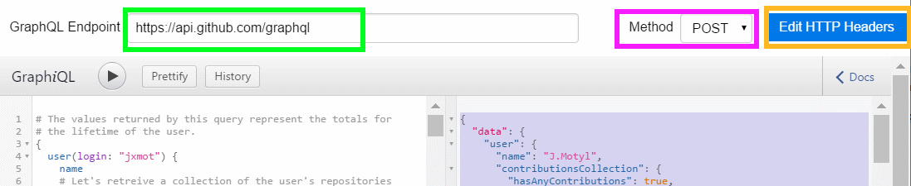
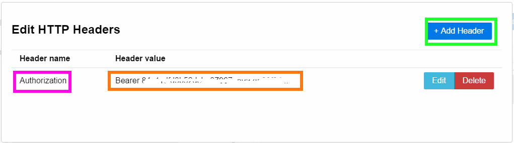
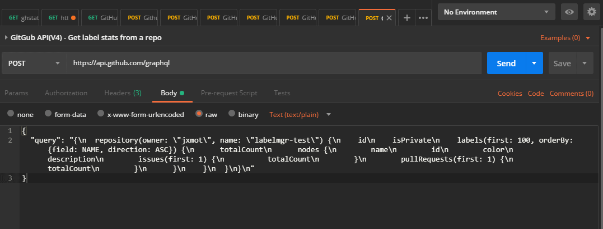
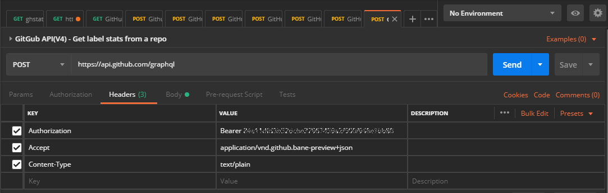

# github-graphql-snippets

A collection of *working* GraphQL *queries* and *mutations* that access the GitHub API V4.

## How I Got Here...

I've been working with the GitHub **V3** API for a while and started looking into switching over to **V4**. It seemed complicated at the time and I didn't have any spare time to devote to the task.

Then I came across [github-readme-stats](<https://github.com/anuraghazra/github-readme-stats>) an application which uses *both* the V3 and V4 API. This gave me a chance to exract the V4 code and try it out.

As a result of "trying it out" I created some queries in order to understand the GitHub V4 API and the data it provides.

## Tools

I've been using the [GraphiQL](<https://github.com/skevy/graphiql-app>) application to test the queries that are provided here. It's not the *best* application, and the last release was two years old. But it is linked to in the GitHup API documentation. 

If you're going to try a different application be sure that you can edit the HTTP headers. It will be necessary for *mutations* and perhaps some queries depending on their *preview*.

Another tool that works well is [Postman](https://www.postman.com/). It can send requests for queries and mutations. And in regards to the HTTP header it's much easier to edit. Each request can have its own header unlike the GraphiQL application.

### GraphiQL Set Up

You'll need the following:

* A GitHub Personal Access Token
* The API Endpoint - https://api.github.com/graphql

The *GitHub Personal Access Token* is obtained through your GitHub account. They can be created in the `Settings->Developer->Personal access tokens` menu.

Enable the following options for your new **GitHub Personal Access Token**:

* `read:gpg_key`
* `read:org`
* `read:public_key`
* `read:repo_hook`
* `repo`
* `user`

Run the GraphiQL application and:

1) Enter the endpoint
2) Select **`POST`** as the method
3) Click the "Edit HTTP Header" button and a dialog box will appear...

<p align="center">
  
</p>

1) Click the "+ Add header" button
2) Under "Header name" enter **`Authorization`**
3) Under "Header value" enter your personal access token, precede it with the word **`Bearer`**. It will look like this: `Bearer xxxxxxxxxxxxxxxxxxxxxxxxxxxxxx` Where `xxx...` is your personal access token.
4) Click "Save".
4) Click anywhere outside of the dialog and it will close.

<p align="center">
  
</p>

Your ready for your first query!

### Application Quirks

* Queries **cannot** be saved from within the application.
* The *output* pane is cleared when switching between tabs.
* The *Documentation Explorer* pane is cleared when switching between tabs.
* Tab *query* panes will be retained when exiting the application. But it appears that this is only done if the query tab has been renamed.

### Postman Notes

To use Postman to send GraphQL you will need the query or mutation formatted so that it will POST correctly. To get the correct formatting start by creating your GraphQL in the GraphiQL application. Then go to the application's "File" menu and click on "Export Query(to clipboard)". 

Paste the clipboard into a Postman *tab* under "Body":

<p align="center">
  
</p>

Then set up the HTTP header:

<p align="center">
  
</p>

Then click "Send" and you should get a response. If the response is an error then either the "Body" is incorrect or the header is wrong. Make sure you placed your GitHub *personal access token* as "Authorization" in the header.

## Queries

If you don't know already GraphQL is a lot different from SQL. Is it better? That depends on a number of things:

* The *structure* of a query is better than SQL. It's a little easier to understand complex queries over SQL.
* Did the implementer document the schema and fields well enough? In the case of the GitHub API it is.

### Example Query

Here's a simple query to start off with:

File: **`/queries/user-lifetime-data.graphql`**

```
# Get Contribution Lifetime Data
# 
# The values returned by this query represent the totals for 
# the lifetime of the user. 
query($_login:String!)
{
  user(login: $_login) {
    name
    # Let's retreive a collection of the user's repositories
    contributionsCollection {
      # will be 'true' if they've had any contributions
      hasAnyContributions
      # The years (2020, 2019, etc) that the use has been contributing
      contributionYears
    }
    # the total number of repositories owned by the user, no forks are counted
    repositories(first: 1, isFork: false, ownerAffiliations: OWNER) {
      totalCount
    }
    # the total number of repositories NOT owned by the user that they contributed to
    repositoriesContributedTo(first: 1) {
      totalCount
    }
    # the total number of pull requests created by the user
    pullRequests(first: 1) {
      totalCount
    }
    # the total number of issues created by the user
    issues(first: 1) {
      totalCount
    }
    # the total number of followers that the user has
    followers(first: 1) {
      totalCount
    }
  }
}

# Variable(s): If using the GraphiQL app the following gets
# placed in the "QUERY VARIABLES" pane. 
{
  "_login": "jxmot"
}

```

And here is the result of the query:

*Please note that this query uses my personal access token. If you run the same query it will return different values.*

```
{
  "data": {
    "user": {
      "name": "J.Motyl",
      "contributionsCollection": {
        "hasAnyContributions": true,
        "contributionYears": [
          2020,
          2019,
          2018,
          2017,
          2016
        ]
      },
      "repositories": {
        "totalCount": 71
      },
      "repositoriesContributedTo": {
        "totalCount": 4
      },
      "pullRequests": {
        "totalCount": 112
      },
      "issues": {
        "totalCount": 166
      },
      "followers": {
        "totalCount": 13
      }
    }
  }
}
```

### Example Query Files

* **`/queries/user-lifetime-data.graphql`** : shown above
* **`/queries/user-lifetime-data-all.graphql`** : based on the previous query, but this one also retrieves the total number of forks, stars, and watchers for each repo
* **`/queries/user-contribs-by_year.graphql`** : retrieves data for the time span specified, a maximum of one year
* **`/queries/user-repos-lang_stats.graphql`** : retrieves the user's repos and lists the languages that each contains
* **`/queries/user-repos-name_id_priv.graphql`** : retrieves the user's repos, and obtains the name, id, and privacy for each one found
* **`/queries/user-repo-issues-open-labeling_timeline.graphql`** : retrieves a user's specific repo, its issues and lists the label operations(*in a timeline*) for each issue.
* **`/queries/user-repo-labels-all-usage.graphql`** : retrieves the labels from a repository and gets a count of pull requests and issues for each label.
* **`/queries/user_verified-lifetime-data.graphql`** : retrieves the validated user's info.
* **`/queries/user_verified-resource_limitations.graphql.graphql`** : retrieve resource limits and usage for the current validated user.

### Queries and Pagination

This described in detail [here](./pagination/README.md)

## Mutations

*Mutations* are the means to create or update things via the V4 API. 

### Example Mutation

Here's a simple mutation to start off with:

File: **`/queries/create-repo-issue.graphql`**

```
# Create an issue in a specified repo.
#
# Use user-repos-name_id_priv.graphql to retreive a list of 
# repositories and their id's.
# 
mutation($data:CreateIssueInput!) {
  createIssue(input:$data) {
    issue {
      createdAt
      id
      title
      number
    }
  }
}
```

The data used by the mutation:

```
{
  "data": {
    "repositoryId": "Your chosen repo's ID",
    "title": "TEST 1 graphql",
    "body": "this is a test 1 of graphql issue creation.",
    "clientMutationId": null
  }
}
```

### Example Mutation Files

* **`/mutations/create-repo-issue.graphql`** : create an issue in a specified repository. A *repository ID* is required, IDs can be obtained with **`/queries/user-repos-name_id_priv.graphql`**
* **`/mutations/create-repo-label.graphql`** : create a label in a specified repository. A *repository ID* is required, IDs can be obtained with **`/queries/user-repos-name_id_priv.graphql`**

#### Mutation Notes

You **must** set the `Accept` field in the HTTP header before sending any of the *label modification* mutations. Add `Accept: ` to the HTTP header, For example:

`Accept: application/vnd.github.bane-preview+json`

For more information go to [labels preview](https://docs.github.com/en/free-pro-team@latest/graphql/overview/schema-previews#labels-preview).

With the HTTP header set that way **all other calls** to the GitHub V4 GrapQL enpoint *should still work*.

## Additional File Contents

Each of the query and mutation files described above also contain the GraphQL code and required data for use in  a POST body. After removing the **`#`** comments the result can be used in [Postman](https://www.postman.com/) to send GraphQL commands.

## GitHub V4 API Quirks

* *Lifetime* data **does not** include any means for obtaining the **lifetime total of commits**. This is frustrating because in order to obtain that value multiple calls to something like **`/queries/user-contribs-by_year.graphql`** must be made.
  * _**NOTE:**_ There is a V3 REST method that can return the number of lifetime *commits*. 
* The method to retrieve *counts* is inconsistent in some cases. For example, in `User.repositories.RepositoryConnection.nodes.Repository` you can directly get counts with `forkCount` and `stargazerCount`. But there is no access for a watcher count. Instead it's necessary to access `User.repositories.RepositoryConnection.nodes.Repository.watchers.totalCount`.
* The value found in `User.ContributionsCollection.restrictedContributionsCount` will be 0 if you are querying your own account, and non-zero when querying a user that is sharing the private contributions.
* The API gives you ability to use many different *mutations*. But it won't allow the creation of labels. Issues, pull requests, and even new repositories are OK.
  * A `createLabel` is documented at `https://docs.github.com/en/free-pro-team@latest/graphql/reference/mutations#createlabel`. But it does not show up in the contextual help in the GraphQL explorers.
  * In order to successfully create a label you must edit the HTTP header and add `Accept:application/vnd.github.bane-preview+json`.

## GraphQL Explorers, Which one to Use?

There are a number of *GraphQL Explorers*. But I've been using the [GraphiQL](<https://github.com/skevy/graphiql-app>) application. One alternative is the [GitHub GraphQL Explorer](https://developer.github.com/v4/explorer/), which makes sense for this project. But it has a major shortcoming: You can't edit the HTTP header.

This is important because in order to perform some operations (*like mutations on labels*) you must change the `Accept` portion of the HTTP header. 

I will update this section as I find alternatives to the quirky GrahpiQL application.

## GraphQL Demonstration Tool

Also included in this repository is my GitHub GraphQL Demonstration tool. It's located in the`/tools/gh-graphql` folder. 

It has the following features :

* Drag and Drop - any one of the `*.graphql` files onto it.
* The `*.graphql` files are automatically parsed and converted to a POST-able format.
* After conversion the GraphQL statements can be sent to GitHub and the responses will be displayed.

A README file can be viewed [here](./tools).

