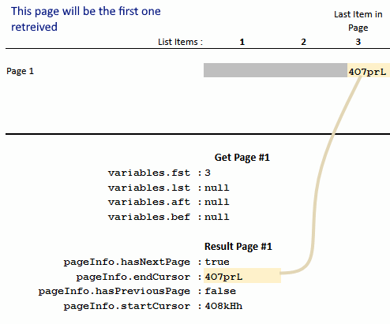
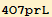
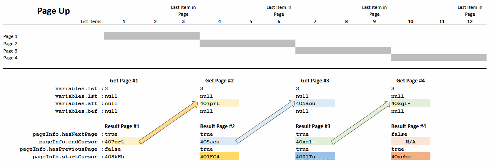
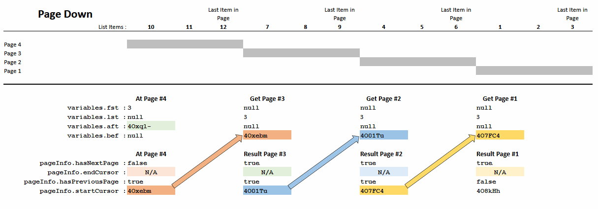

# GraphQL Pagination

*Pagination* is the arrangement of a list of items. The entire list of items is broken done into smaller groups (*pages*) so the list is easier to navigate. In general the *pages* are the same size with the exception of the *last page*. It is possible that the last page may contain a smaller group of items as compared to the previous pages.

In this document I will retrieve a list of my *starred repositories*. I've starred over 200 of them so when I request a list they will be grouped into *pages*. The GitHub V4 API will proved a unique ID for each page. Navigation is accomplished by using those page IDs to navigate up or down in the list of starred repositories.

# Queries and Pagination

It took me a bit to understand how *pagination* works under the GitHub's implementation of GraphQL. Honestly it isn't that difficult. But the available documentation does not seem to provide any *workable* examples or a very clear explanation.

The GitHub GraphQL uses the *Complete Connection Model* method of pagination. Which is partially descrbed [here](https://graphql.github.io/learn/pagination/#complete-connection-model). 

Pagination Examples:

* **`/queries/user-verified-pagination-starred_repos.graphql`** : retrieves the validated user's list of starred repos where pagination can applied.

## Pagination in Detail

Using the **`/queries/user-verified-pagination-starred_repos.graphql`** file I will attempt to explain how pagination works under the GitHub GraphQL API.

First, open a GraphQL *explorer*. This example should also work with GitHub's [GraphQL Explorer](https://docs.github.com/en/free-pro-team@latest/graphql/overview/explorer). Open the Explorer and *paste* the following into it:

The query:

<pre>
query($fst:Int, $lst:Int, $aft:String, $bef:String) {
  viewer {
    login
    name
    starredRepositories(orderBy: {direction: DESC, field: STARRED_AT},
                        first: $fst,
                        last: $lst,
                        after: $aft,
                        before: $bef) {
      totalCount<strong>
      # This will be necessary for navigating between the pages.
      pageInfo {
        hasNextPage
        endCursor
        hasPreviousPage
        startCursor
      }</strong>
      edges {
        starredAt
        node {
          name
          stargazerCount
          primaryLanguage {
            name
            color
          }
        }
      }
    }
  }
}
</pre>

Variables needed by the query, paste this into the *query variables* pane :

```
{
  "fst": 3,
  "lst": null,
  "aft": null,
  "bef": null
}
```

<details>
<summary>
<strong>Here is the reply to the query above:</strong>(<i>click to expand</i>)
</summary>
<pre>
{
  "data": {
    "viewer": {
      "login": "jxmot",
      "name": "J.Motyl",
      "starredRepositories": {
        "totalCount": 279,<strong>
        "pageInfo": {
          "hasNextPage": true,
          "endCursor": "Y3Vyc29yOnYyOpK5MjAyMC0xMi0xNFQxMTo0Mjo0My0wNjowMM4O_J02",
          "hasPreviousPage": false,
          "startCursor": "Y3Vyc29yOnYyOpK5MjAyMC0xMi0xNlQxMzoyODoyMC0wNjowMM4PAfB-"
        },</strong>
        "edges": [
          {
            "starredAt": "2020-12-16T19:28:20Z",
            "node": {
              "name": "mermaid",
              "stargazerCount": 33444,
              "primaryLanguage": {
                "name": "JavaScript",
                "color": "#f1e05a"
              }
            }
          },
          {
            "starredAt": "2020-12-16T18:59:42Z",
            "node": {
              "name": "jscompress.com",
              "stargazerCount": 239,
              "primaryLanguage": {
                "name": "HTML",
                "color": "#e34c26"
              }
            }
          },
          {
            "starredAt": "2020-12-14T17:42:43Z",
            "node": {
              "name": "prettier",
              "stargazerCount": 38397,
              "primaryLanguage": {
                "name": "JavaScript",
                "color": "#f1e05a"
              }
            }
          }
        ]
      }
    }
  }
}

</pre>
</details>

To see how pagination works use these steps:

  1) Run the query with the data as shown above
  2) After the successful query, copy the string from the result at `pageInfo.endCursor` into the `aft` data item
  3) Run the query again
  4) The next "page" will be returned

  Steps 2 - 4 can be repeated until `pageInfo.hasNextPage` 
  becomes `false`.

  5) To go to the previous page copy the string from the result at `pageInfo.startCursor` into the `bef` data item
  6) Set **`aft`** to `null`
  7) Set **`fst`** to `null`
  8) Set **`lst`** to 3
  9) Run the query again
 10) The previous "page" will be returned

  Steps 6 - 9 can be repeated until `pageInfo.hasPreviousPage` becomes `false`.

**NOTE**: You will need to have some starred repositories under your account. The minimum recommended for this demonstration is 12. If you have a lot of starred repos change the value used in **`fst`** and **`lst`** to a larger value. For example, if you had 100 starred repos you could change that value from `3` to `25`. That would give you 4 pages of 25 items.

# Pagination, a graphical representation

*Note: the* `pageInfo.endCursor` *values below have be dramatically shortened tb be easier to follow in the subsequent diagrams*. 

First let's take a look at the result of requesting the *first page*:

<p align="center">
  
</p>

The result of the first query will give us  in `pageInfo.endCursor`. That value will be used to navigate *up* to the next page of starred repositories.

## Page Up

<p align="center">
  
</p>

## Page Down

<p align="center">
  
</p>


