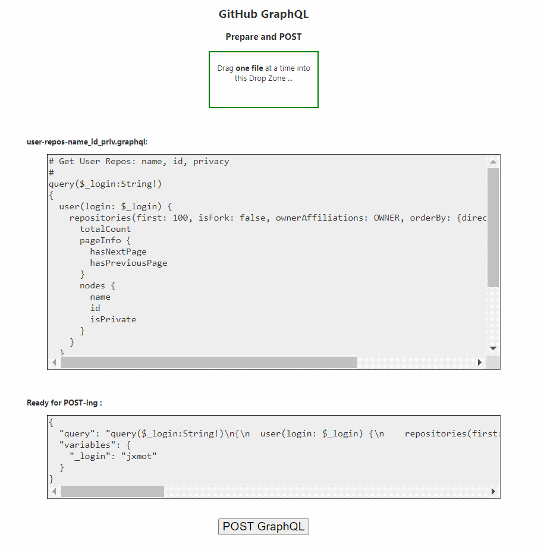
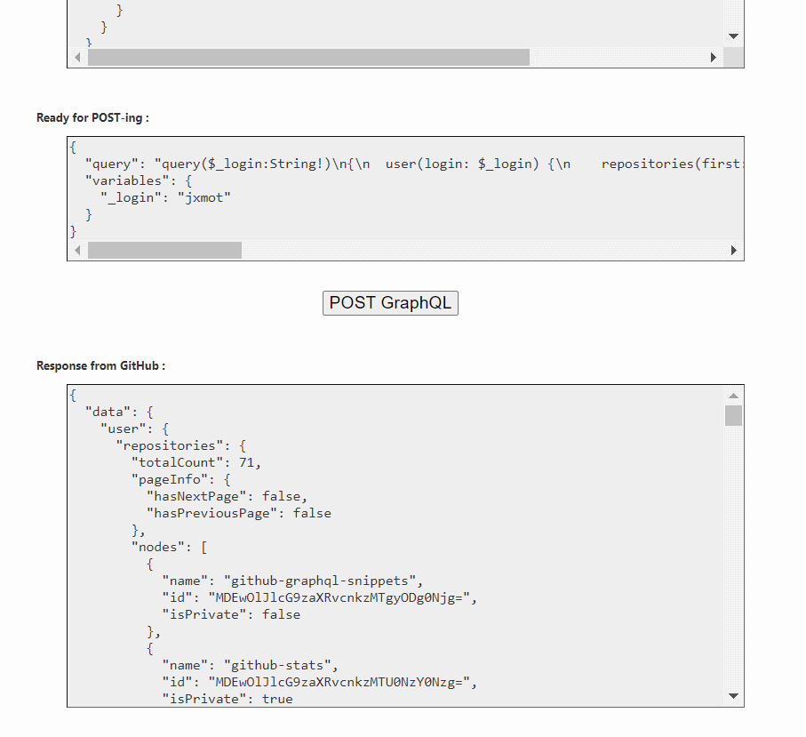

# Github GraphQL Tools

This folder will contain GitHub *specific* tools. They're not fancy, an probably not that cool. But I had a "need" and created what's here to fill the need.

## gh-graphql

A browser tool that can covert a *human readable* GraphQL statement file into the required format for POST-ing it to the GitHub V4 API.

It can also send the GraphQL statement to the GitHub V4 endpoint and display the response.

### Usage

Run the `gh-graphql.html` file directly in the browser of your choice. It is not necssary to host the file.

Any of the `*.graphql` files in [`/queries`](../queries) or [`/mutations`](../mutations) can be ran from it. Just drag and drop one of the files where prompted and it will be *automatically* converted to the necessary format for POST-ing to GitHub.

### Screen Shots

Load the `gh-graphql.html` into your browser. 

<p align="center">
  
</p>

<br><br>

The drag and drop one of the query or mutation files into the box at the top of the page and it will be read and reformatted into the GitGub GraphQL POST-body format.

<p align="center">
  
</p>

<br><br>

Next click the "POST GraphQL" button and the query/mutation will be POSTed to GitHub. If there are no errors the response will be shown below the button.

<p align="center">
  
</p>

### *.graphql File Format

The files are plain text, with `\n`, `\r\n` or `\r` line endings. The format of the GraphQL statment should be:

```
# Comments are optional, they're stripped out before conversion
query
{
  # GrapQL query here
}
```

And if variables are used:

```
# Comments are optional, they're stripped out before conversion
query
{
  # GrapQL query here
}
{
  "test":"this is a variable"
}
```


## To Do (maybe)

* Add the ability to edit *variables*.
* **TBD**

